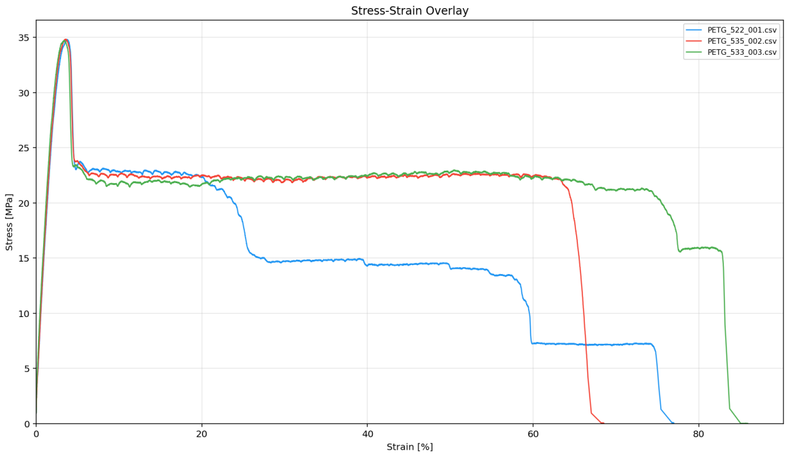
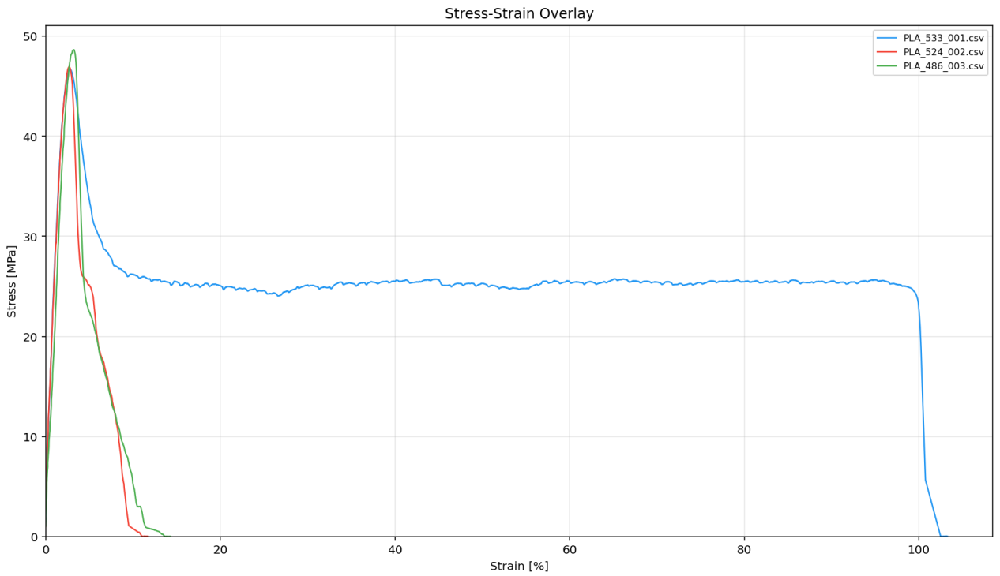
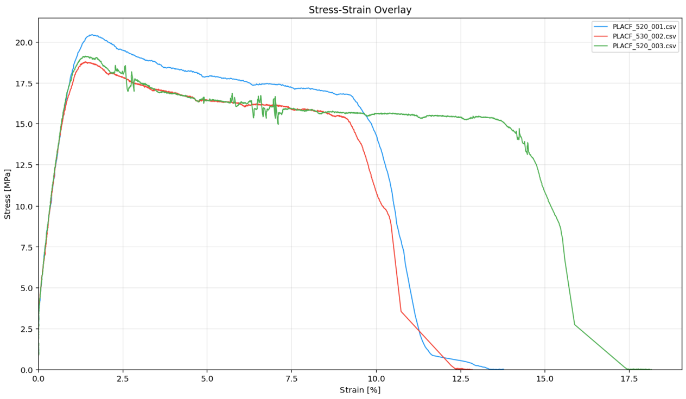

# Desktop Tensile Testing Machine

A custom-built desktop tensile testing machine for characterizing 3D-printed polymer specimens according to ISO 527. Designed and built from scratch — mechanical assembly, electronics, firmware (Arduino/C++), and data acquisition & analysis software (Python).

> Personal engineering project bridging mechanical testing, embedded systems, and data analysis.

<!-- 📸 PHOTO: Hero shot of the full machine assembly -->

---

## Key Results

Three FDM-printed materials tested (ISO 527-2 Type 1BA dogbone, 5 mm/min, n = 3 each):

| Material | UTS [MPa] | E-Modulus [GPa] | Elongation |
|---|---|---|---|
| **PETG** (eSUN) | 34.8 ± 0.1 | 1.63 ± 0.10 | 77.1 ± 8.7% |
| **PLA** (eSUN) | 47.4 ± 1.1 | 2.68 ± 0.46 | 12–103%\* |
| **PLA-CF** (PolyTerra) | 19.5 ± 0.9 | 1.88 ± 0.16 | 14.9 ± 2.8% |

\*PLA near brittle-ductile transition — 2 of 3 specimens fractured, 1 exhibited cold drawing. UTS consistent across all three.

PETG repeatability of **± 0.1 MPa** across three specimens demonstrates the measurement capability of the system. All values fall within published ranges for FDM-printed specimens.

→ [Detailed results and stress-strain curves](#results)

---

## Machine Overview

<!-- 📸 PHOTO: Annotated overview of the machine (label frame, motor, load cell, grips, lead screw) -->

A stepper motor drives a ball screw that pulls the specimen at a controlled displacement rate. Force is measured with a load cell, displacement is derived from step counting, and an accelerometer monitors for mechanical faults during the test.

### Specifications

| Parameter | Value |
|---|---|
| Max. force | ~980 N (load cell limit) |
| Displacement resolution | 0.005 mm/step |
| Load cell | 100 kg (HX711 ADC, 10 Hz) |
| Drive | NEMA 34 stepper + DM542T driver (4× microstepping) |
| Lead screw | Ball screw, 4 mm pitch |
| Specimen standard | ISO 527-2 Type 1BA |
| Frame | 3D-printed components + aluminum extrusion |

---

## System Architecture

```
┌──────────────┐     ┌──────────────┐     ┌──────────────┐
│   Arduino     │────▶│  DM542T      │────▶│  NEMA 34     │
│   Firmware    │     │  Driver      │     │  Stepper     │
│              │◀────│  HX711 ADC   │◀────│  100kg Cell  │
│              │◀────│  ADXL345     │     │  Accel.      │
└──────┬───────┘     └──────────────┘     └──────────────┘
       │ Serial (115200 baud)
       ▼
┌──────────────┐
│   Python      │
│   test.py     │──▶ Real-time data logging (.csv)
└──────┬───────┘
       │
       ▼
┌──────────────┐
│   Python      │
│   analyze.py  │──▶ Compliance correction
│              │──▶ Stress-strain analysis
│              │──▶ Multi-specimen comparison
└──────────────┘
```

---

## Firmware (Arduino)

The firmware handles motor control, sensor acquisition, and safety monitoring in a single control loop.

- **Constant-speed displacement control** — timer-interrupt-driven stepping for precise speed regulation independent of loop timing
- **10 Hz synchronized data acquisition** — force (HX711), acceleration (ADXL345 via SPI), and step count sampled in lockstep and streamed over serial
- **Serial command interface** — `START`, `STOP`, `SPEED`, `TARE` commands for control from the Python host
- **Over-force protection** — requires 3 consecutive over-limit readings before emergency stop, filtering single-sample HX711 glitches
- **Endstop + mechanical failsafe** — an endstop limits travel in normal operation. If the endstop fails, the crosshead drives into a structural steel stop that absorbs the load without damaging the frame or lead screw
- **Step loss detection** — uses the ADXL345 accelerometer to detect stepper motor skip events via vibration analysis. A force-level check distinguishes step loss (force still above threshold) from specimen fracture (force drops). Detailed analysis in [`docs/step_loss_detection.pdf`](docs/step_loss_detection.pdf)

Step loss detection was implemented as a signal processing exercise — in practice the motor operates well within its torque range for the loads tested here. But it demonstrates a useful fault-detection pattern for any open-loop stepper system: rather than adding an encoder, an existing sensor (accelerometer) is repurposed to infer position faults from vibration signatures.

<!-- 📸 PHOTO: Close-up of electronics (Arduino, driver, load cell, accelerometer) -->

→ [`firmware/`](firmware/)

---

## Data Acquisition (`test.py`)

Python host application that controls the test and logs all sensor data.

- Serial communication with the Arduino (command/response protocol)
- Automatic CSV logging with timestamped filenames
- Configurable test speed
- On-demand plotting during test execution

Each test produces a CSV with columns: `time_s`, `steps`, `displacement_mm`, `force_raw`, `force_N`, `accel_x`, `accel_y`, `accel_z`, `endstop`, `step_loss`.

→ [`software/test.py`](software/test.py)

---

## Post-Processing (`analyze.py`)

Interactive command-line tool for analyzing test data.

### Compliance Correction

Raw crosshead displacement includes elastic deformation of the machine frame, load cell, and grips — not just the specimen. This system compliance was characterized by clamping a rigid steel bar and recording the force-displacement response of the machine itself, producing a lookup table that is subtracted from every test:

```
d_specimen = d_measured − d_system(F)
```

This is the same approach used in commercial testing machines. Without correction, the E-modulus is underestimated significantly — the machine frame (762 N/mm) is in the same stiffness range as the specimens, making this correction essential rather than optional.

→ Detailed characterization method in [`docs/compliance_correction.pdf`](docs/compliance_correction.pdf)

### Analysis Pipeline

1. **Compliance correction** — subtract machine deformation via interpolated lookup
2. **Preload trim** — discard data below 10 N (settling/contact region), zero corrected displacement
3. **Engineering stress & strain** — σ = F/A₀, ε = Δd/L₀
4. **Tensile strength** — maximum stress
5. **E-modulus** — linear regression in the 0.05–0.25% strain range
6. **Elongation at break**

### Multi-Specimen Comparison

```
> add          → load another specimen
> overlay      → stress-strain overlay plot
> stats        → mean ± standard deviation
```

→ [`software/analyze.py`](software/analyze.py)

---

## Results

All tests: 5 mm/min crosshead speed, ~24 °C ambient, ISO 527-2 Type 1BA specimens, 100% infill, 0° raster orientation.

### PETG (eSUN)



| Specimen | UTS [MPa] | E-Modulus [GPa] | Elongation [%] |
|---|---|---|---|
| #1 | 34.8 | 1.52 | 77.0 |
| #2 | 34.8 | 1.65 | 68.5 |
| #3 | 34.7 | 1.73 | 85.9 |
| **Mean ± SD** | **34.8 ± 0.1** | **1.63 ± 0.10** | **77.1 ± 8.7** |

The three stress-strain curves are nearly indistinguishable up to the yield point. Post-yield behavior shows progressive layer delamination with stepwise force drops — characteristic of FDM-printed PETG where individual layers peel apart sequentially. Published UTS values for FDM PETG typically range from 28–44 MPa; the measured 34.8 MPa falls well within this range.

<!-- 📸 PHOTO: PETG fracture surface — fibrous, stringy delamination -->

### PLA (eSUN PLA Basic)



| Specimen | UTS [MPa] | E-Modulus [GPa] | Elongation [%] |
|---|---|---|---|
| #1 | 46.7 | 2.97 | 103.3 |
| #2 | 46.9 | 2.91 | 11.8 |
| #3 | 48.7 | 2.15 | 14.3 |
| **Mean ± SD** | **47.4 ± 1.1** | **2.68 ± 0.46** | — |

UTS is consistent (± 1.1 MPa) but failure mode varied: two specimens fractured in a brittle manner at ~12–14% strain, while one underwent extensive cold drawing to over 100%. This is typical of PLA near its brittle-ductile transition — small microstructural variations determine which mode dominates. Published values for FDM PLA at 100% infill are typically 42–55 MPa; the measured 47.4 MPa is consistent.

<!-- 📸 PHOTO: PLA fracture surface — clean, flat break -->

### PLA-CF (PolyTerra PLA-CF)



| Specimen | UTS [MPa] | E-Modulus [GPa] | Elongation [%] |
|---|---|---|---|
| #1 | 20.5 | 1.99 | 13.8 |
| #2 | 18.8 | 1.70 | 12.8 |
| #3 | 19.1 | 1.95 | 18.2 |
| **Mean ± SD** | **19.5 ± 0.9** | **1.88 ± 0.16** | **14.9 ± 2.8** |

PLA-CF showed significantly reduced strength and stiffness compared to unfilled PLA. Fracture surfaces revealed extensive porosity with visible voids between extrusion lines. This is a known limitation of short-fiber composites in FDM: carbon fibers increase melt viscosity and disrupt interlayer bonding, reducing the effective load-bearing cross-section. With optimized print parameters (higher temperature, slower speed, wider extrusion) these results could likely be improved — quantifying that would be an interesting follow-up study.

This result also demonstrates the machine's ability to resolve quality differences between materials and detect the mechanical impact of print defects.

<!-- 📸 PHOTO: PLA-CF fracture surface — porous, visible voids and white crazing -->

---

## Validation Summary

| Metric | Result |
|---|---|
| Force repeatability (PETG, n=3) | ± 0.1 MPa (± 0.3%) |
| UTS accuracy vs. literature | within published ranges for all materials |
| System stiffness | 762 N/mm |
| Step loss detection | validated, firmware-integrated |
| Material differentiation | clearly resolves PLA vs. PETG vs. PLA-CF |

---

## Skills Demonstrated

- **Mechanical design** — frame layout, load path, grip design, ball screw selection
- **Electronics** — stepper driver integration, load cell signal conditioning (HX711), SPI accelerometer
- **Embedded firmware** — real-time motor control, multi-sensor acquisition, interrupt-driven timing, safety systems (C++)
- **Signal processing** — compliance correction, vibration-based fault detection
- **Data analysis** — automated post-processing, statistical validation, multi-specimen comparison (Python, NumPy)
- **Materials science** — ISO 527 methodology, stress-strain interpretation, fracture analysis
- **CAD** — mechanical design of frame, grips, and structural components

---

## Future Improvements

- **Wedge grips** — current hex-screw clamping causes wear and is slow to operate. Self-tightening wedge grips would improve usability.
- **Closed-loop control** — an encoder would eliminate reliance on step loss detection entirely.
- **Extensometer** — clip-on or video extensometer for direct gauge-section strain measurement, removing dependence on crosshead displacement and compliance correction.
- **Higher-rate ADC** — the HX711's 10 Hz limits dynamic measurements. A faster ADC would improve capture of fracture and step loss events.

---

## Built With

- Arduino Uno
- DM542T stepper driver + NEMA 34 motor
- HX711 + 100 kg load cell
- ADXL345 accelerometer (SPI)
- Python (NumPy, Matplotlib, PySerial...)
- Fusion 360
- 3D-printed structural components

---

